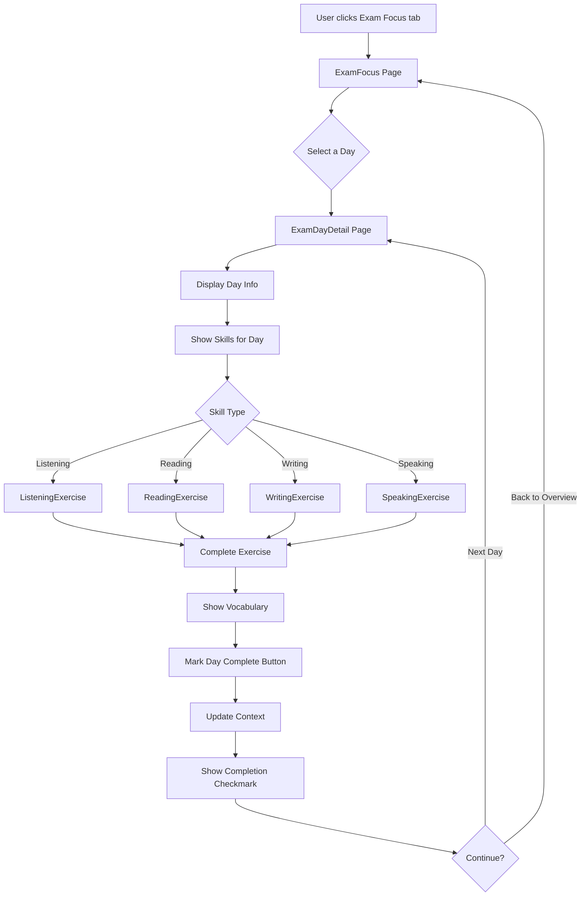

# Exam Focus Feature - Technical Architecture

## Overview
This document defines the complete architecture for the "Exam Focus" feature - a 30-day Goethe A1 exam preparation program integrated into the German Tutor application.

---

## 1. Data Structure & TypeScript Interfaces

### Location: `src/data/exam/examTypes.ts`

```typescript
// Core skill types for the exam
export type ExamSkill = 'Listening' | 'Reading' | 'Writing' | 'Speaking';

// Question types for interactive exercises
export type QuestionType = 'multiple-choice' | 'true-false' | 'fill-blank' | 'matching' | 'open-ended';

// Individual exercise question
export interface ExamQuestion {
  id: string;
  type: QuestionType;
  question: string;
  options?: string[];  // For multiple-choice
  correctAnswer: string | string[];
  explanation?: string;
  audioUrl?: string;  // For listening questions
  imageUrl?: string;  // For visual aids
}

// Section within a skill (e.g., Listening Part 1, Part 2, Part 3)
export interface ExamSection {
  part: number;
  title: string;
  instructions: string;
  questions: ExamQuestion[];
  audioUrl?: string;  // Main audio file for the section
  timeLimit?: number; // Optional time limit in seconds
}

// Complete practice for one skill
export interface SkillPractice {
  skill: ExamSkill;
  sections: ExamSection[];
}

// Vocabulary for the day
export interface VocabularyItem {
  german: string;
  english: string;
  example?: string;
  audioUrl?: string;
}

export interface VocabularyTheme {
  theme: string;
  items: VocabularyItem[];
}

// A complete exam day
export interface ExamDay {
  day: number;
  title: string;
  skills: ExamSkill[];  // e.g., ['Listening', 'Reading'] for Day 1
  practices: SkillPractice[];
  vocabulary: VocabularyTheme;
  tips?: string[];  // Exam tips specific to this day
}

// Progress tracking for exam focus
export interface ExamFocusProgress {
  completedDays: number[];
  lastAccessedDay?: number;
  skillScores?: {
    [dayNumber: number]: {
      [skill in ExamSkill]?: {
        score: number;
        totalQuestions: number;
        completedAt: string;
      }
    }
  };
}
```

---

## 2. File Structure

```
src/
├── data/
│   └── exam/
│       ├── examTypes.ts              # TypeScript interfaces
│       ├── examFocusData.ts          # Main data export/index
│       └── days/
│           ├── day01.ts              # Listening + Reading
│           ├── day02.ts              # Writing + Speaking
│           ├── day03.ts              # Listening + Reading
│           └── ... (day04-day30)
│
├── components/
│   └── exam/
│       ├── ListeningExercise.tsx     # Audio playback + questions
│       ├── ReadingExercise.tsx       # Text + comprehension questions
│       ├── WritingExercise.tsx       # Text input areas
│       ├── SpeakingExercise.tsx      # Recording/prompts
│       ├── VocabularySection.tsx     # Themed vocabulary display
│       ├── SkillBadge.tsx            # Visual skill indicators
│       └── ExamProgressTracker.tsx   # Progress overview
│
├── pages/
│   ├── ExamFocus.tsx                 # Main exam focus page (day grid)
│   └── ExamDayDetail.tsx             # Individual day practice page
│
├── context/
│   └── AppContext.tsx                # Updated with exam progress state
│
└── utils/
    └── examUtils.ts                  # Utility functions (skill rotation logic)
```

---

## 3. Component Architecture

### 3.1 Main Page: ExamFocus.tsx

**Purpose**: Landing page showing all 30 days in a grid

**Features**:
- Grid/calendar view of all 30 days
- Visual indicators for:
  - Completed days (strikethrough/checkmark)
  - Current day (highlighted)
  - Locked vs unlocked days (optional)
- Click day → navigate to ExamDayDetail
- Progress overview (X/30 days completed)
- Filter by skill (show only Listening days, etc.)

**Key Props/State**:
```typescript
// Uses context
const { examFocusProgress } = useAppContext();

// Local state
const [filterSkill, setFilterSkill] = useState<ExamSkill | 'all'>('all');
```

---

### 3.2 Day Detail Page: ExamDayDetail.tsx

**Purpose**: Practice page for a specific day

**Features**:
- Display day number and title
- Show which skills are practiced today (auto-determined)
- Render appropriate skill components
- Vocabulary section (collapsible)
- "Mark as Complete" button at bottom
- Navigation to previous/next day

**URL Pattern**: `/exam-focus/day/:dayNumber`

**Key Props/State**:
```typescript
const { dayNumber } = useParams();
const { examFocusProgress, completeExamDay } = useAppContext();
const [currentSkillIndex, setCurrentSkillIndex] = useState(0);
const [answers, setAnswers] = useState<Record<string, any>>({});
```

---

### 3.3 Skill Components

#### ListeningExercise.tsx

**Features**:
- Audio player with play/pause/seek controls
- Question display (multiple sections/parts)
- Answer input (multiple choice, true/false)
- Auto-submit or manual submit
- Show correct answers after submission
- Visual feedback (correct/incorrect)

**Props**:
```typescript
interface ListeningExerciseProps {
  practice: SkillPractice;
  onComplete: (score: number, total: number) => void;
}
```

**Audio Implementation**:
- Use HTML5 `<audio>` element or React audio library
- Audio files stored in `/public/audio/exam/day-XX/`
- Format: MP3 or OGG for browser compatibility

---

#### ReadingExercise.tsx

**Features**:
- Display text passages
- Multiple sections (Part 1, Part 2, Part 3)
- Interactive questions below each passage
- Answer tracking
- Immediate or delayed feedback
- Highlight correct/incorrect answers

**Props**:
```typescript
interface ReadingExerciseProps {
  practice: SkillPractice;
  onComplete: (score: number, total: number) => void;
}
```

---

#### WritingExercise.tsx

**Features**:
- Instructions for writing task
- Text area for free-form writing
- Character/word counter
- Template/example provided
- Save draft functionality
- No auto-grading (manual review)

**Props**:
```typescript
interface WritingExerciseProps {
  practice: SkillPractice;
  onComplete: (response: string) => void;
}
```

---

#### SpeakingExercise.tsx

**Features**:
- Display prompts/cue cards
- Record audio response (browser MediaRecorder API)
- Playback recorded audio
- Timer for timed responses
- Save recording (optional)
- No auto-grading (self-assessment)

**Props**:
```typescript
interface SpeakingExerciseProps {
  practice: SkillPractice;
  onComplete: (audioBlob?: Blob) => void;
}
```

---

#### VocabularySection.tsx

**Features**:
- Display themed vocabulary (reference only)
- German word + English translation
- Example sentence
- Optional audio pronunciation
- Collapsible/expandable
- Flashcard-style view (optional)

**Props**:
```typescript
interface VocabularySectionProps {
  vocabulary: VocabularyTheme;
}
```

---

#### SkillBadge.tsx

**Purpose**: Visual indicator for skill type

**Features**:
- Icon for each skill (🎧 Listening, 📖 Reading, ✍️ Writing, 🗣️ Speaking)
- Color-coded badges
- Shows skill name
- Optional: shows completion status

**Props**:
```typescript
interface SkillBadgeProps {
  skill: ExamSkill;
  completed?: boolean;
  size?: 'small' | 'medium' | 'large';
}
```

---

#### ExamProgressTracker.tsx

**Purpose**: Show overall exam focus progress

**Features**:
- Progress bar (X/30 days)
- Breakdown by skill (how many Listening days completed)
- Calendar heat map (optional)
- Streak counter (consecutive days)
- Estimated completion date

**Props**:
```typescript
interface ExamProgressTrackerProps {
  progress: ExamFocusProgress;
}
```

---

## 4. Context & State Management

### Update to AppContext.tsx

```typescript
interface AppContextType {
  // ... existing fields ...
  
  // NEW: Exam Focus Progress
  examFocusProgress: ExamFocusProgress;
  completeExamDay: (dayNumber: number, scores?: Record<ExamSkill, {score: number, total: number}>) => void;
  resetExamProgress: () => void;
}
```

**Implementation**:
```typescript
const [examFocusProgress, setExamFocusProgress] = useState<ExamFocusProgress>({
  completedDays: [],
  lastAccessedDay: undefined,
  skillScores: {}
});

const completeExamDay = (
  dayNumber: number, 
  scores?: Record<ExamSkill, {score: number, total: number}>
) => {
  setExamFocusProgress(prev => {
    const newCompletedDays = [...prev.completedDays];
    if (!newCompletedDays.includes(dayNumber)) {
      newCompletedDays.push(dayNumber);
    }
    
    return {
      ...prev,
      completedDays: newCompletedDays.sort((a, b) => a - b),
      lastAccessedDay: dayNumber,
      skillScores: scores ? {
        ...prev.skillScores,
        [dayNumber]: scores
      } : prev.skillScores
    };
  });
};

const resetExamProgress = () => {
  setExamFocusProgress({
    completedDays: [],
    lastAccessedDay: undefined,
    skillScores: {}
  });
};
```

**Persistence**:
- Store in `localStorage` under key `examFocusProgress`
- Load on app mount
- Save on every progress update

---

## 5. Utility Functions

### Location: `src/utils/examUtils.ts`

```typescript
import { ExamSkill } from '../data/exam/examTypes';

/**
 * Determine which skills are practiced on a given day
 * Day 1, 3, 5... (odd) = Listening + Reading
 * Day 2, 4, 6... (even) = Writing + Speaking
 */
export function getSkillsForDay(dayNumber: number): ExamSkill[] {
  return dayNumber % 2 === 1 
    ? ['Listening', 'Reading'] 
    : ['Writing', 'Speaking'];
}

/**
 * Calculate progress percentage
 */
export function calculateProgress(completedDays: number[], totalDays: number = 30): number {
  return Math.round((completedDays.length / totalDays) * 100);
}

/**
 * Get next recommended day
 */
export function getNextDay(completedDays: number[], totalDays: number = 30): number {
  for (let i = 1; i <= totalDays; i++) {
    if (!completedDays.includes(i)) {
      return i;
    }
  }
  return totalDays; // All complete
}

/**
 * Calculate skill-specific completion
 */
export function getSkillCompletionStats(
  completedDays: number[], 
  skill: ExamSkill
): { completed: number; total: number } {
  let total = 0;
  let completed = 0;
  
  for (let day = 1; day <= 30; day++) {
    const skills = getSkillsForDay(day);
    if (skills.includes(skill)) {
      total++;
      if (completedDays.includes(day)) {
        completed++;
      }
    }
  }
  
  return { completed, total };
}
```

---

## 6. Routing Updates

### Update `src/App.tsx`

```typescript
import ExamFocus from './pages/ExamFocus';
import ExamDayDetail from './pages/ExamDayDetail';

// Inside Routes:
<Route path="exam-focus" element={<ExamFocus />} />
<Route path="exam-focus/day/:dayNumber" element={<ExamDayDetail />} />
```

---

## 7. Navigation Updates

### Update `src/components/Layout.tsx`

Add new nav item:

```typescript
import { BookOpen, Home, GraduationCap, BrainCircuit, Target } from 'lucide-react';

// In navigation:
<NavItem to="/exam-focus" icon={<Target size={20} />} label="Exam Focus" />
```

---

## 8. Data Implementation Example - Day 1

### Location: `src/data/exam/days/day01.ts`

```typescript
import { ExamDay } from '../examTypes';

export const day01: ExamDay = {
  day: 1,
  title: '🎧 Listening + 📖 Reading',
  skills: ['Listening', 'Reading'],
  practices: [
    {
      skill: 'Listening',
      sections: [
        {
          part: 1,
          title: 'Teil 1: Short Dialogues',
          instructions: 'Listen to 6 short dialogues about everyday situations. For each dialogue, answer the question about who, what, where, or when.',
          audioUrl: '/audio/exam/day-01/listening-part1.mp3',
          questions: [
            {
              id: 'l1-q1',
              type: 'multiple-choice',
              question: 'Where is the conversation taking place?',
              options: ['At a supermarket', 'At a train station', 'At a restaurant'],
              correctAnswer: 'At a supermarket',
              explanation: 'The dialogue mentions "Kasse" (checkout) which indicates a supermarket.',
              audioUrl: '/audio/exam/day-01/dialogue-1.mp3'
            },
            // ... more questions
          ]
        }
      ]
    },
    {
      skill: 'Reading',
      sections: [
        {
          part: 1,
          title: 'Teil 1: Short Messages',
          instructions: 'Read 2 short emails or letters (40-70 words each). Answer true/false questions about the content.',
          questions: [
            {
              id: 'r1-q1',
              type: 'true-false',
              question: 'Maria invites Tom to a party on Saturday.',
              correctAnswer: 'true',
              explanation: 'The email says "Kommst du am Samstag zu meiner Party?"'
            },
            // ... more questions
          ]
        }
      ]
    }
  ],
  vocabulary: {
    theme: 'Personal Information',
    items: [
      { german: 'der Name', english: 'name', example: 'Mein Name ist Anna.' },
      { german: 'das Alter', english: 'age', example: 'Wie alt bist du?' },
      { german: 'die Adresse', english: 'address', example: 'Meine Adresse ist...' },
      // ... more vocabulary
    ]
  },
  tips: [
    'Read all questions BEFORE audio starts',
    'Focus on keywords: Wann? Wo? Was? Wer?',
    'Don\'t panic if you miss something - keep moving forward'
  ]
};
```

---

## 9. User Flow Diagram



---

## 10. Styling Guidelines

**Design Consistency**:
- Use existing glass-panel, glass-card classes
- Maintain color scheme (indigo/purple/pink gradient)
- Skill badges color-coded:
  - Listening: Blue (#3B82F6)
  - Reading: Green (#10B981)
  - Writing: Purple (#8B5CF6)
  - Speaking: Orange (#F59E0B)

**Day Grid Layout**:
- 7 columns (week view) or 5 columns
- Each day card shows:
  - Day number
  - Skill icons
  - Completion status
  - Hover effect with preview

**Responsive**:
- Mobile: 2-3 columns
- Tablet: 4-5 columns
- Desktop: 7 columns

---

## 11. Audio Implementation Details

**IMPORTANT NOTE FOR FUTURE IMPLEMENTATION:**
For all listening exercises in future days (Day 3, 5, 8, 10, 12, 15, 17, 19, 22, 24, 26, etc.), keep PLACEHOLDER references only. Do NOT write actual listening content until audio files are available. Use placeholder structure like:

```typescript
const listeningPractice: ListeningPractice = {
  part: 1,
  title: 'Teil 1: [Topic]',
  description: '[PLACEHOLDER - Audio content to be added]',
  instructions: '[PLACEHOLDER - Listening instructions to be added when audio is ready]',
  questions: [] // Empty array - questions will be added with audio
};
```

**Audio File Structure**:
```
public/
└── audio/
    └── exam/
        ├── day-01/
        │   ├── listening-part1.mp3
        │   ├── dialogue-1.mp3
        │   ├── dialogue-2.mp3
        │   └── ...
        ├── day-03/
        └── ...
```

**Audio Player Features**:
- Play/Pause button
- Progress bar with seek
- Volume control
- Playback speed (0.75x, 1x, 1.25x)
- Replay button
- Display current time / total duration

**Implementation**:
- Use HTML5 `<audio>` element
- Or library: `react-h5-audio-player`
- Preload: metadata or auto

---

## 12. Progress Persistence

**LocalStorage Schema**:
```typescript
{
  "examFocusProgress": {
    "completedDays": [1, 2, 3],
    "lastAccessedDay": 3,
    "skillScores": {
      "1": {
        "Listening": { "score": 8, "totalQuestions": 10, "completedAt": "2026-01-04T10:30:00Z" },
        "Reading": { "score": 9, "totalQuestions": 10, "completedAt": "2026-01-04T11:00:00Z" }
      }
    }
  }
}
```

**Save Strategy**:
- Save after every day completion
- Save scores after each skill practice
- Debounce writes to prevent excessive updates

---

## 13. Future Enhancements (Out of Scope for Initial Implementation)

- Export progress as PDF report
- Share progress on social media
- Leaderboard/comparison with other users
- AI-powered feedback on writing/speaking exercises
- Adaptive difficulty based on performance
- Spaced repetition for vocabulary
- Integration with actual Goethe exam booking

---

## 14. Testing Checklist

- [ ] Day grid displays all 30 days correctly
- [ ] Skill rotation logic works (odd=L+R, even=W+S)
- [ ] Audio playback functions properly
- [ ] Questions submit and show correct/incorrect
- [ ] Progress saves to localStorage
- [ ] Completed days show strikethrough/checkmark
- [ ] Navigation between days works
- [ ] Responsive design on mobile/tablet/desktop
- [ ] Vocabulary section displays correctly
- [ ] "Mark Complete" button updates state
- [ ] Context provider shares state correctly
- [ ] Routing works for all day URLs
- [ ] Navbar highlights Exam Focus when active

---

## 15. Implementation Priority

**Phase 1 (MVP)**:
1. Data structures and types
2. Day 1 complete data
3. Main ExamFocus page (grid view)
4. ExamDayDetail page (basic)
5. ListeningExercise component (with audio)
6. ReadingExercise component
7. Context updates for progress
8. Mark day complete functionality

**Phase 2 (Enhancement)**:
1. WritingExercise component
2. SpeakingExercise component
3. VocabularySection component
4. Progress tracker component
5. All 30 days data
6. Advanced audio controls
7. Score tracking

**Phase 3 (Polish)**:
1. Animations and transitions
2. Advanced filtering
3. Statistics dashboard
4. Export/share features

---

## Summary

This architecture provides:
- ✅ Independent progress tracking (separate from syllabus)
- ✅ New navbar tab for Exam Focus
- ✅ Audio playback for Listening exercises
- ✅ Interactive quiz components for all skills
- ✅ Auto-determined skills based on day number
- ✅ Separate vocabulary component per day
- ✅ Strikethrough/completion marking
- ✅ Scalable structure for all 30 days
- ✅ Reusable components
- ✅ TypeScript type safety

The design follows existing app patterns while adding specialized exam-focused functionality.